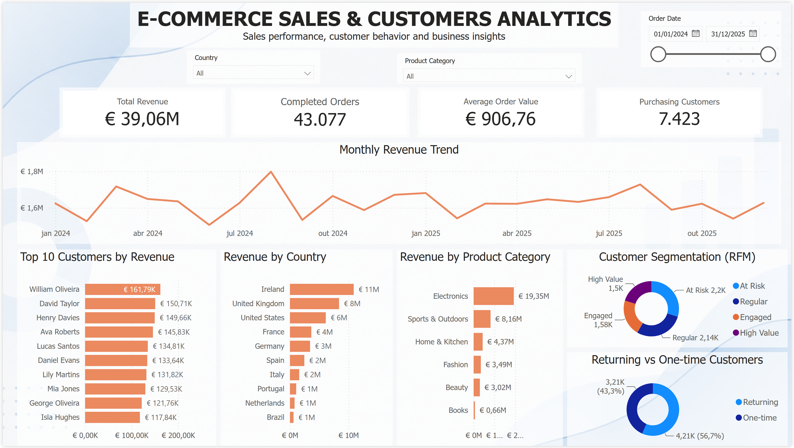

# E-commerce Sales & Customer Analytics


A SQL-based data analytics project focused on e-commerce sales performance, customer behavior, product performance, sales trends, and customer segmentation using PostgreSQL.

> **Key metrics:** €39.06M revenue | 43,077 completed orders | €906.76 average order value | 7,423 purchasing customers

---

## Table of Contents

- [Introduction](#introduction)
- [Business Questions](#business-questions)
- [Dataset](#dataset)
- [Revenue Definition](#revenue-definition)
- [Analysis & Methodology](#analysis--methodology)
- [Key Business Insights](#key-business-insights)
- [RFM Customer Segmentation](#rfm-customer-segmentation)
- [Business Recommendations](#business-recommendations)
- [SQL Skills Demonstrated](#sql-skills-demonstrated)
- [Project Structure](#project-structure)
- [How to Run](#how-to-run)
- [Project Validation](#project-validation)
- [Future Improvements](#future-improvements)
- [Project Status](#project-status)
- [Author](#author)
- [Resumo Executivo — Português](#resumo-executivo--português)

---

## Introduction

The objective of this project is to analyze e-commerce sales and customer behavior using SQL and PostgreSQL.

The analysis was designed around real-world business questions commonly faced by e-commerce companies. It transforms transactional data into actionable insights about revenue performance, customer purchasing behavior, product and category performance, sales trends, and customer retention opportunities.

The project also includes an **RFM (Recency, Frequency, Monetary) customer segmentation** to identify different customer behavior patterns and support targeted retention and loyalty strategies.

---

## Power BI Dashboard

The project includes an interactive Power BI dashboard designed to explore sales performance and customer behavior.



The dashboard includes:

- Total Revenue
- Completed Orders
- Average Order Value
- Purchasing Customers
- Monthly Revenue Trend
- Top 10 Customers by Revenue
- Revenue by Country
- Revenue by Product Category
- RFM Customer Segmentation
- Returning vs One-time Customers

Interactive filters are available for:

- Country
- Product Category
- Order Date

---

## Business Questions

- What is the total revenue generated by completed orders?
- What is the average order value?
- Which customers generate the most revenue?
- Which products generate the most revenue?
- Which product categories perform best?
- How does revenue change over time?
- What is the monthly revenue growth?
- How many customers are returning customers?
- How frequently do customers purchase?
- Which products are the top performers within each category?
- What is the cumulative revenue over time?
- Which customers have maintained a relationship with the business for a long period?
- How can customers be segmented based on purchasing behavior?

---

## Dataset

The project uses a synthetic e-commerce dataset generated with Python.

| Table | Records | Description |
|---|---:|---|
| Customers | 10,000 | Customer information |
| Products | 500 | Product and category information |
| Orders | 50,000 | Customer orders and order status |
| Order Items | 131,694 | Products, quantities, and prices per order |

The data covers orders from **January 2024 to December 2025**.

### Order Status

| Status | Orders |
|---|---:|
| Completed | 43,077 |
| Cancelled | 3,413 |
| Pending | 2,000 |
| Returned | 1,510 |
| **Total** | **50,000** |

---

## Revenue Definition

For this analysis, revenue is calculated using **completed orders only**.

```text
Revenue = Quantity × Unit Price
```

Orders with `Cancelled`, `Pending`, or `Returned` status are excluded from revenue calculations.

This business rule was applied consistently across revenue, average order value, product, category, customer, and RFM analyses.

---

## Analysis & Methodology

### Data Exploration & Validation

- Validated record counts.
- Checked order statuses.
- Verified relationships between transactional tables.
- Checked for orphan records in foreign-key relationships.

### Customer Analysis

- Customer revenue
- Top customers
- Returning customers
- Purchase frequency
- First and last purchase dates
- Customer lifetime duration
- Monthly customer spending

### Product & Category Analysis

- Product revenue
- Category revenue
- Revenue share by category
- Top-performing product within each category
- Product ranking using window functions

### Sales Analysis

- Total revenue
- Average order value
- Monthly revenue
- Month-over-month revenue change
- Cumulative revenue

### Advanced Customer Analysis

Applied:

- `RANK()`
- `DENSE_RANK()`
- `ROW_NUMBER()`
- `LAG()`
- `NTILE()`
- CTEs
- `CASE`
- Subqueries
- Window functions

The final advanced analysis used RFM segmentation to classify customers according to purchasing behavior.

---

## Key Business Insights

### Revenue Performance

| KPI | Result |
|---|---:|
| Total Revenue | **€39,090,687.01** |
| Completed Orders | **43,077** |
| Average Order Value | **€907.50** |
| Total Customers | **10,000** |
| Customers with Completed Purchases | **7,423** |

The analysis generated **€39.09M in revenue from 43,077 completed orders**, with an average order value of approximately **€907.50**.

### Customer Engagement

Out of 10,000 registered customers, **7,423 customers had at least one completed purchase**, representing approximately **74.2% of the customer base**.

Approximately **25.8% of registered customers did not generate a completed purchase** during the analyzed period, representing a potential customer activation and conversion opportunity.

---

## RFM Customer Segmentation

RFM analysis was performed on the **7,423 customers with at least one completed purchase**.

- **Recency:** days since the customer's most recent completed purchase.
- **Frequency:** number of completed orders.
- **Monetary:** total revenue generated by the customer.

Each dimension was scored from **1 to 5 using `NTILE(5)`**, with higher scores representing stronger customer value.

### RFM Segments

| Segment | Customers | Share |
|---|---:|---:|
| At Risk | 2,201 | **29.65%** |
| Regular | 2,139 | **28.82%** |
| Engaged | 1,582 | **21.31%** |
| High Value | 1,501 | **20.22%** |
| **Total** | **7,423** | **100%** |

### Interpretation

- **At Risk — 29.65%:** The largest customer segment, representing a potential reactivation and retention opportunity.
- **Regular — 28.82%:** Recurring customers who may have opportunities to increase purchase frequency or spending.
- **Engaged — 21.31%:** Customers showing positive purchasing behavior who may have potential to become higher-value customers.
- **High Value — 20.22%:** Customers with strong overall RFM scores who represent an important group for retention and loyalty initiatives.

---

## Business Recommendations

### 1. Reactivate At Risk Customers
Develop targeted reactivation campaigns using personalized offers, product recommendations, and time-limited incentives.

### 2. Retain High Value Customers
Create loyalty programs, exclusive offers, and personalized experiences for High Value customers.

### 3. Increase Purchase Frequency
Use personalized recommendations and targeted promotions to encourage Regular and Engaged customers to purchase more frequently.

### 4. Investigate Non-Purchasing Customers
Analyze the approximately 25.8% of registered customers who did not generate a completed purchase to identify potential barriers in the customer journey.

### 5. Monitor Customer Segments Over Time
Repeat the RFM analysis periodically to identify customers moving between segments and measure retention performance.

---

## SQL Skills Demonstrated

`SELECT` · `WHERE` · `ORDER BY` · `JOIN` · `GROUP BY` · `HAVING` · `CASE` · Subqueries · CTEs · Aggregate Functions · Window Functions · `OVER()` · `PARTITION BY` · `RANK()` · `DENSE_RANK()` · `ROW_NUMBER()` · `LAG()` · `NTILE()` · Date Functions · Data Validation

---

## Project Structure

```text
ecommerce-sales-customer-analytics/

├── data/
│   ├── customers.csv
│   ├── products.csv
│   ├── orders.csv
│   └── order_items.csv
│
├── scripts/
│   └── generate_data.py
│
├── sql/
│   ├── 01_database_setup.sql
│   ├── 02_data_exploration.sql
│   ├── 03_customer_analysis.sql
│   ├── 04_product_analysis.sql
│   ├── 05_sales_analysis.sql
│   ├── 06_advanced_analysis.sql
│   └── 07_project_validation.sql
│
├── images/
│   └── dashboard.png
│
├── .gitignore
└── README.md
```

---

## How to Run

### Requirements

- PostgreSQL 15+
- Python 3+
- VS Code
- SQLTools or another PostgreSQL client

### Create the database

```sql
CREATE DATABASE ecommerce_sales_db;
```

Connect to it:

```sql
\c ecommerce_sales_db
```

### Create the tables

Run:

```text
sql/01_database_setup.sql
```

### Generate the dataset

```bash
python scripts/generate_data.py
```

### Load the data

Import the generated CSV files into PostgreSQL.

### Run the analysis

Execute the SQL files in order:

```text
02_data_exploration.sql
03_customer_analysis.sql
04_product_analysis.sql
05_sales_analysis.sql
06_advanced_analysis.sql
07_project_validation.sql
```

---

## Project Validation

The final validation queries were used to confirm:

- Expected record counts.
- Completed order count.
- Revenue calculation.
- Average order value.
- Customer purchase coverage.
- RFM segment distribution.
- Referential integrity between orders and order items.
- Referential integrity between products and order items.

### Validated Core Results

```text
Customers:              10,000
Products:                   500
Orders:                  50,000
Order Items:            131,694
Completed Orders:        43,077
Total Revenue:     €39,060,687.01
Average Order Value:       €906.76
RFM Customers:             7,423
```

---

## Future Improvements

Potential extensions of this project include:

- Customer Lifetime Value (CLV)
- Cohort retention analysis
- Customer retention KPIs
- Revenue forecasting
- Product recommendation analysis
- Automated data quality checks
- Python-based ETL pipeline
- Airflow orchestration
- Cloud data warehouse integration
- Extension of the project into a Data Engineering pipeline

---

## Project Status

**Completed — SQL Analytics & Customer Segmentation**

The core data generation, PostgreSQL database, SQL analysis, RFM customer segmentation, business insights, and validation steps have been completed.

---

## Author

**Thais Cristina Da Costa**

Data Analytics | SQL | Python | Tableau

---

# 🇧🇷 Resumo Executivo — Português

## Sobre o Projeto

Este projeto analisa dados de vendas e comportamento de clientes de um e-commerce utilizando **PostgreSQL e SQL**.

O objetivo foi analisar receita, comportamento dos clientes, performance de produtos e categorias, evolução das vendas e oportunidades de retenção.

O projeto também utiliza **RFM (Recency, Frequency e Monetary)** para segmentar clientes de acordo com seu comportamento de compra.

### Principais Resultados

- **€39,06 milhões** em receita de pedidos concluídos.
- **43.077 pedidos concluídos**.
- **€906,76** de ticket médio.
- **7.423 clientes** realizaram pelo menos uma compra concluída.
- Isso representa aproximadamente **74,2% dos 10.000 clientes cadastrados**.
- Aproximadamente **25,8% dos clientes cadastrados não realizaram uma compra concluída**.

### Segmentação RFM

Entre os 7.423 clientes que realizaram compras concluídas:

| Segmento | Clientes | Percentual |
|---|---:|---:|
| At Risk | 2.201 | **29,65%** |
| Regular | 2.139 | **28,82%** |
| Engaged | 1.582 | **21,31%** |
| High Value | 1.501 | **20,22%** |

### Principais Insights

O maior segmento identificado foi o de **At Risk**, representando **30,94% dos clientes compradores**, indicando uma oportunidade relevante para campanhas de reativação e retenção.

O segmento **High Value representa 21,02%** dos clientes compradores, sendo um grupo importante para estratégias de fidelização.

### Recomendações

1. Criar campanhas de reativação para clientes **At Risk**.
2. Desenvolver programas de fidelidade para clientes **High Value**.
3. Utilizar recomendações personalizadas para aumentar a frequência de compra.
4. Investigar os clientes cadastrados que ainda não realizaram compras concluídas.
5. Monitorar a evolução dos segmentos RFM ao longo do tempo.

### Tecnologias

**PostgreSQL | SQL | Python | Git | GitHub**

### Principais conceitos SQL

**JOIN | GROUP BY | HAVING | CTE | CASE | Subqueries | Window Functions | RANK | DENSE_RANK | ROW_NUMBER | LAG | NTILE**
